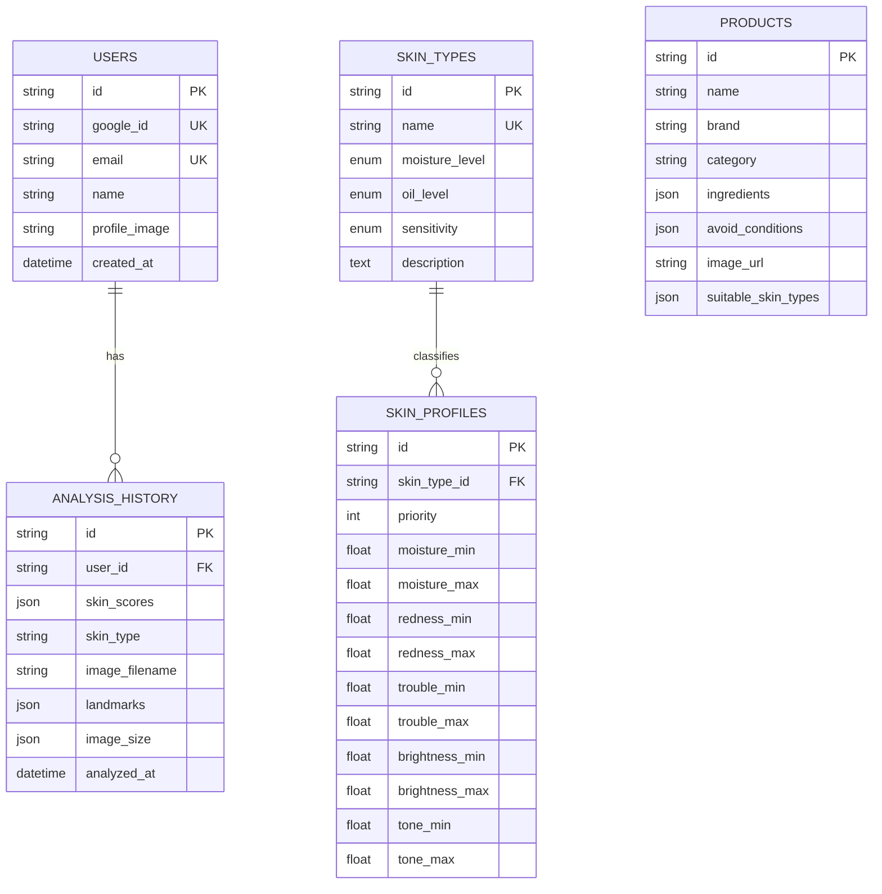

# Entity Relationship Diagram (ERD)

**Project:** SKAI
**Source:** `backend/db/models.py` (SQLAlchemy)

---

## 1. Diagram

---

## 2. Tables

### users
구글 OAuth로 가입한 사용자 계정.

| Column | Type | Notes |
|--------|------|-------|
| id | String | PK (UUID) |
| google_id | String | Unique, 구글 계정 식별자(`sub`) |
| email | String | Unique |
| name | String | |
| profile_image | String | 구글 프로필 이미지 URL |
| created_at | DateTime | 가입일 |

### analysis_history
로그인 사용자의 피부 분석 기록.

| Column | Type | Notes |
|--------|------|-------|
| id | String | PK (UUID) |
| user_id | String | FK → users.id |
| skin_scores | JSON | 5대 지표 + 종합 점수 |
| skin_type | String | dry / oily / sensitive / combination |
| image_filename | String | uploads 내 저장 파일명 |
| landmarks | JSON | MediaPipe 랜드마크 좌표 배열 |
| image_size | JSON | { width, height } |
| analyzed_at | DateTime | 분석 시각 |

### products
화장품 데이터 (Open Beauty Facts 기반). FK 없이 추천 로직으로 매칭.

| Column | Type | Notes |
|--------|------|-------|
| id | String | PK |
| name | String | |
| brand | String | |
| category | String | skincare / foundation / lip 등 |
| ingredients | JSON | 성분 목록 |
| avoid_conditions | JSON | 피해야 하는 피부 상태 |
| image_url | String | 제품 이미지 URL |
| suitable_skin_types | JSON | 적합 피부 타입 ID 목록 |

### skin_types
피부 타입 정의 (참조 테이블).

| Column | Type | Notes |
|--------|------|-------|
| id | String | PK (UUID) |
| name | String | Unique (dry, oily 등) |
| moisture_level | Enum | low / mid / high |
| oil_level | Enum | low / mid / high |
| sensitivity | Enum | low / mid / high |
| description | Text | |

### skin_profiles
점수 범위 → 피부 타입 분류 임계값. priority 순으로 평가해 첫 매치 적용.

| Column | Type | Notes |
|--------|------|-------|
| id | String | PK (UUID) |
| skin_type_id | String | FK → skin_types.id |
| priority | Integer | 높을수록 먼저 평가 |
| moisture_min / max | Float | 수분 점수 범위 (NULL = 제약 없음) |
| redness_min / max | Float | 홍조 점수 범위 |
| trouble_min / max | Float | 트러블 점수 범위 |
| brightness_min / max | Float | 밝기 점수 범위 |
| tone_min / max | Float | 톤 균일도 점수 범위 |

---

## 3. Relationships

- **users (1) — (N) analysis_history** : 한 사용자는 여러 분석 기록을 가진다. 회원 탈퇴 시 기록도 함께 삭제.
- **skin_types (1) — (N) skin_profiles** : 한 타입은 여러 점수 범위 프로필을 가질 수 있다.
- **products** : 외래키 없이 독립 존재. 추천 시 성분·카테고리 매칭 로직으로 필터링된다.